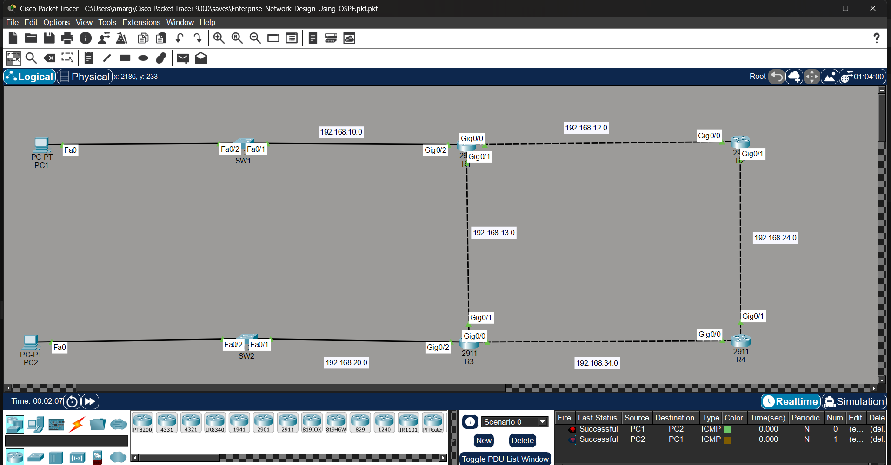
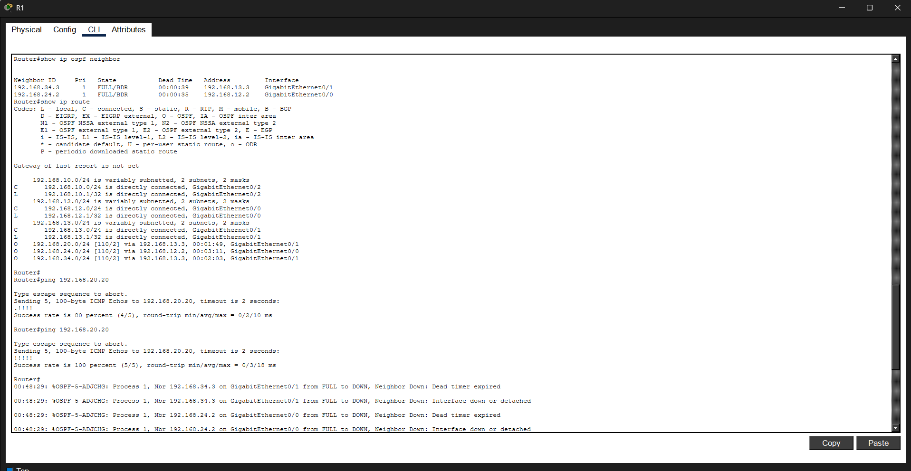
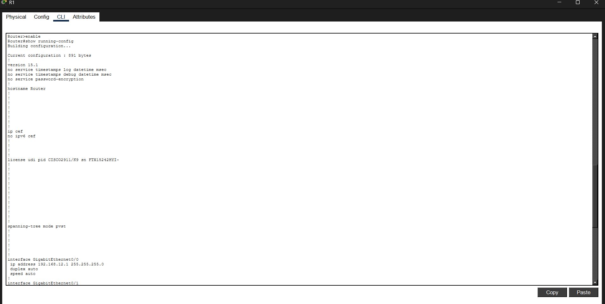
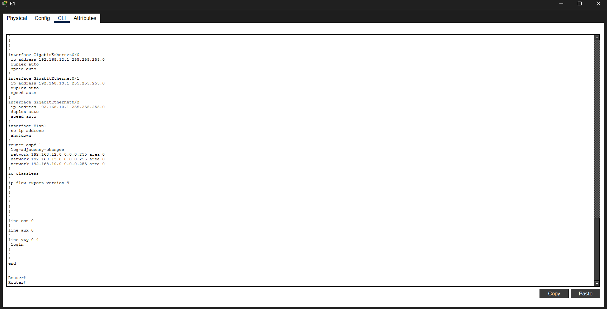
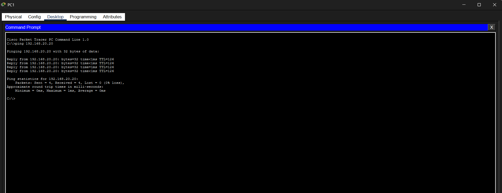

    # Enterprise Network Design using OSPF

## Overview

This project demonstrates the design and implementation of an enterprise network using Cisco Packet Tracer. The network is configured using the OSPF (Open Shortest Path First) dynamic routing protocol to enable communication between multiple network segments.

The objective of this project is to strengthen practical networking skills through hands-on configuration, routing verification, and end-to-end connectivity testing.

---

## 📸 Project Screenshots

### 1. Network Topology

---

### 2. OSPF IP Configuration

---

### 3. OSPF Neighbor Relationship

---

### 4. OSPF Configuration (Part 1)

---

### 5. OSPF Configuration (Part 2)

---

### 6. End-to-End Connectivity Test

---

## Network Topology

- 4 Cisco Routers
- 2 Cisco 2960 Switches
- 2 PCs
- Multiple IPv4 Networks
- OSPF Area 0

---

## Technologies Used

- Cisco Packet Tracer
- OSPF (Open Shortest Path First)
- IPv4 Addressing
- Dynamic Routing
- Routing & Switching
  
---

## Features

- Enterprise network topology
- IPv4 addressing configuration
- OSPF Area 0 implementation
- Dynamic route learning
- Router neighbor verification
- Routing table verification
- End-to-end connectivity testing
- Configuration saved using Cisco IOS

---

## Verification Commands

show ip interface brief

show ip ospf neighbor

show ip route

show ip protocols

show running-config

ping

---

## Project Outcome

Successfully configured OSPF dynamic routing between multiple routers and verified communication between different network segments using routing tables, neighbor relationships, and successful ping tests.

---

## Learning Outcomes

- Enterprise Network Design
- IPv4 Addressing
- OSPF Configuration
- Cisco IOS CLI
- Routing Verification
- Network Troubleshooting
- CCNA Practical Skills

---
